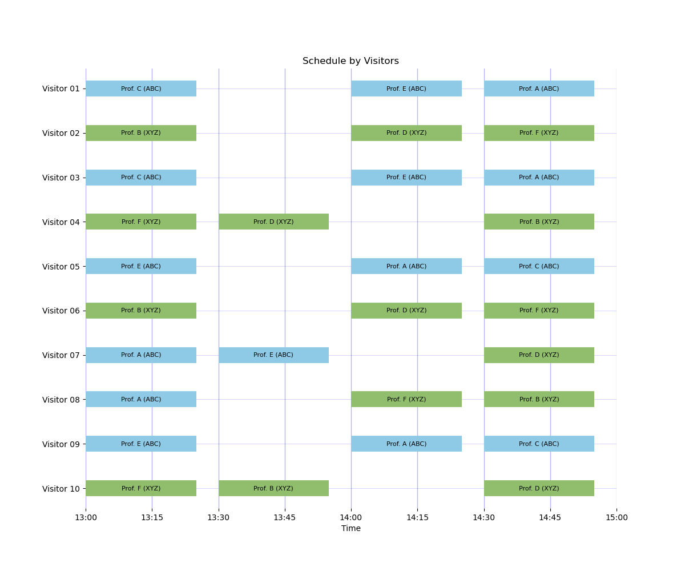
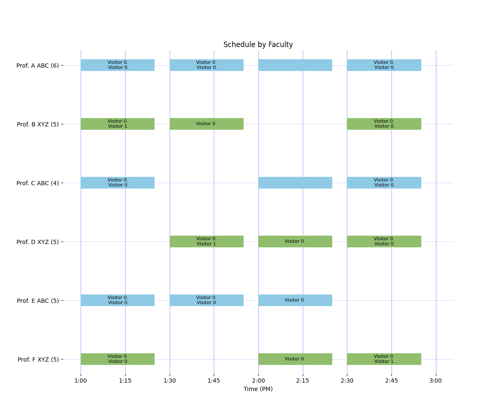

# Graduate Visit Scheduler

Mixed integer optimization-based scheduler for visitor-faculty meetings at department recruitment events. Created by [Alex Dowling](https://engineering.nd.edu/faculty/alexander-dowling/) and [Jeff Kantor](https://engineering.nd.edu/news/in-memoriam-jeffrey-kantor-former-vice-president-associate-provost-and-dean/) at the University of Notre Dame.

[](https://github.com/dowlinglab/grad-visit-scheduler)
[](https://colab.research.google.com/github/dowlinglab/grad-visit-scheduler/blob/main/examples/large_example_colab.ipynb)

## Motivation

Many graduate programs host recruitment visits where prospective students meet faculty one-on-one or in small groups. Building schedules by hand is difficult because preferences, availability, group limits, room/building constraints, and break/travel windows all interact.

This project packages the scheduling workflow used for graduate recruitment at [Notre Dame CBE](https://cbe.nd.edu) as an open-source Python tool. Under the hood, it builds and solves a mixed-integer linear program (MILP) in Pyomo.

## Workflow

The scheduler takes three input files:

- Faculty catalog YAML (faculty metadata, areas, status, building/room).
- Run configuration YAML (building slots, break slots, availability constraints, weights).
- Visitor preferences CSV (ranked faculty choices and research area interests).

Outputs include:

- Optimized visitor-faculty assignments.
- Faculty-view and visitor-view schedule plots.
- Optional DOCX exports of individualized visitor schedules.

## Scheduling Example

The documentation includes a realistic worked example with 10 visitors, 6 faculty, two buildings (`ABC` and `XYZ`), three topic areas (`Energy`, `Bio`, `Theory`), and several faculty scheduling conflicts.

Visitor-view schedule:



Faculty-view schedule:



How to interpret these schedules:

- `ABC` and `XYZ` are building abbreviations from the run config. The box color (blue versus green) also indicates the building.
- In visitor-view plots, labels are `Faculty (Building)` and blank slots indicate breaks or travel windows.
- In faculty-view plots, the number in parentheses next to each faculty name is that faculty member's total number of scheduled meetings.

Full setup, model details, and solver outputs are documented in [Quickstart](quickstart.md) and [Mathematical Formulation](formulation.md).

```{toctree}
:maxdepth: 2
:caption: Contents

installation
quickstart
api
formulation
releasing
```
