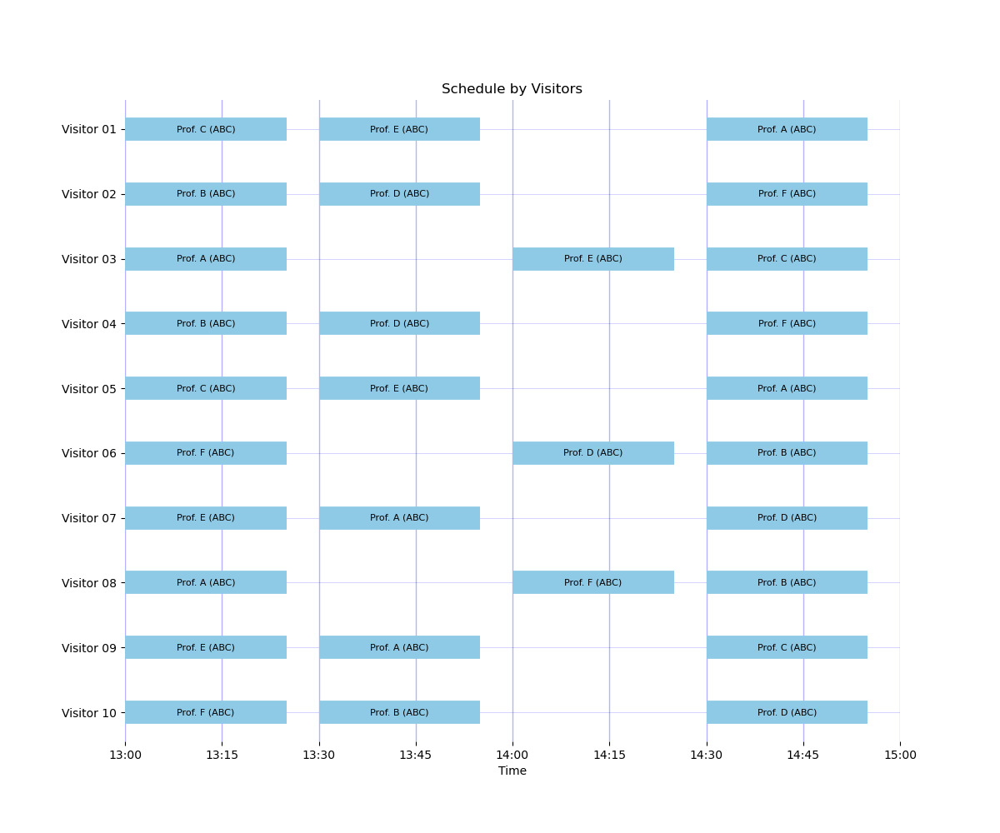
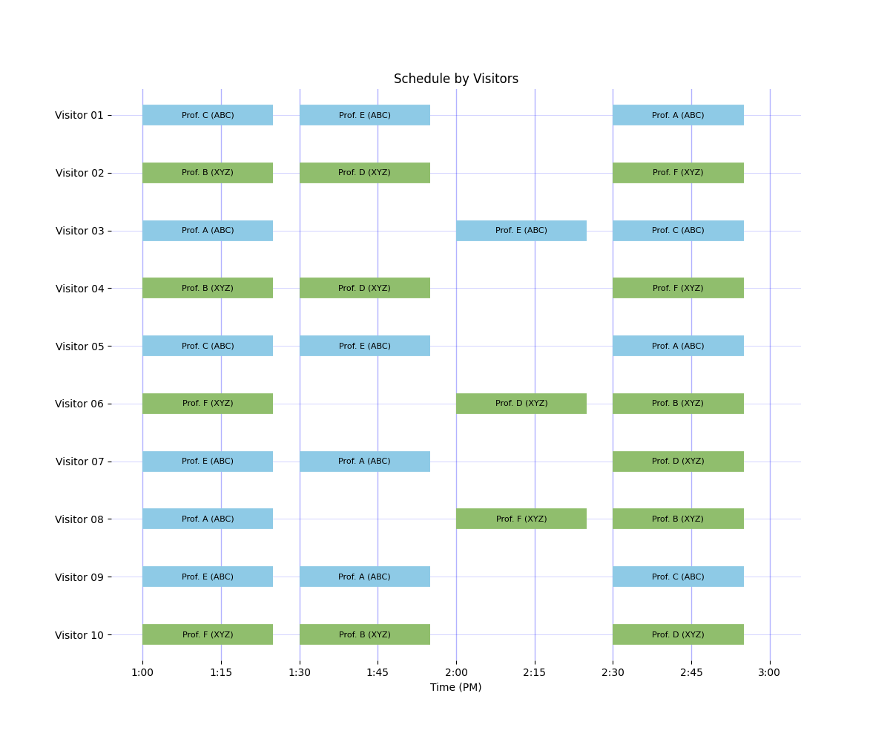
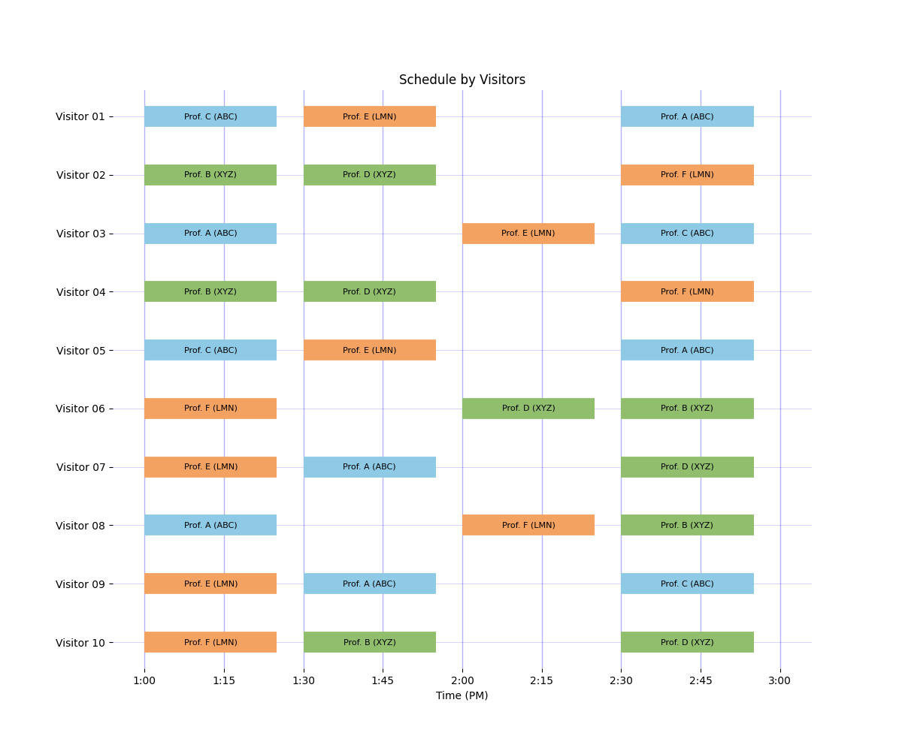
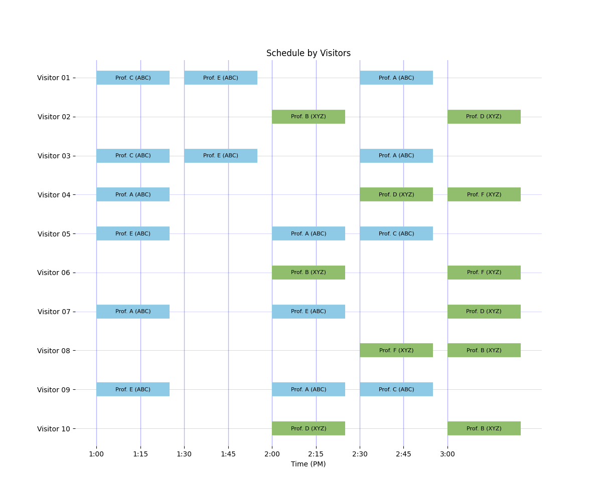
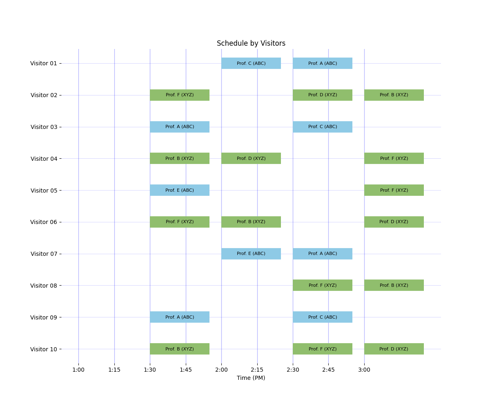
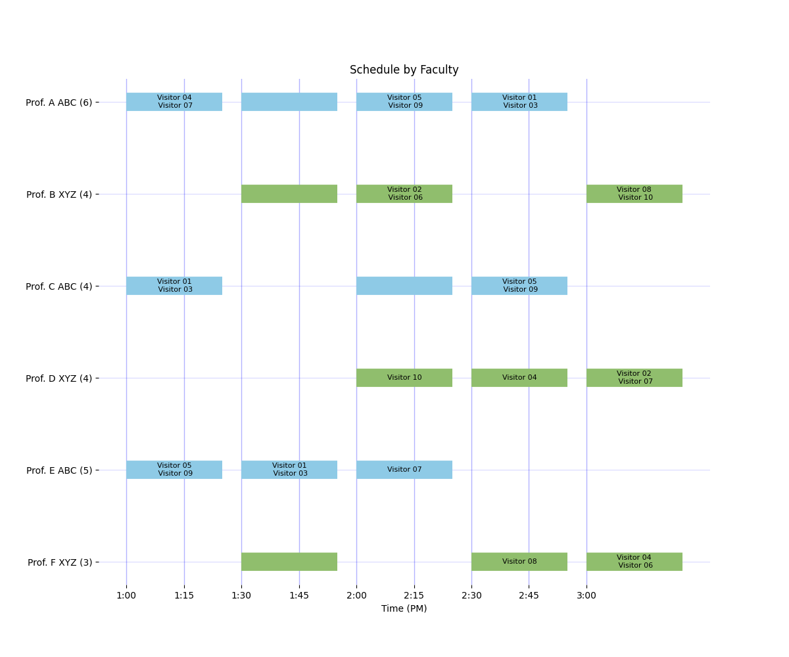
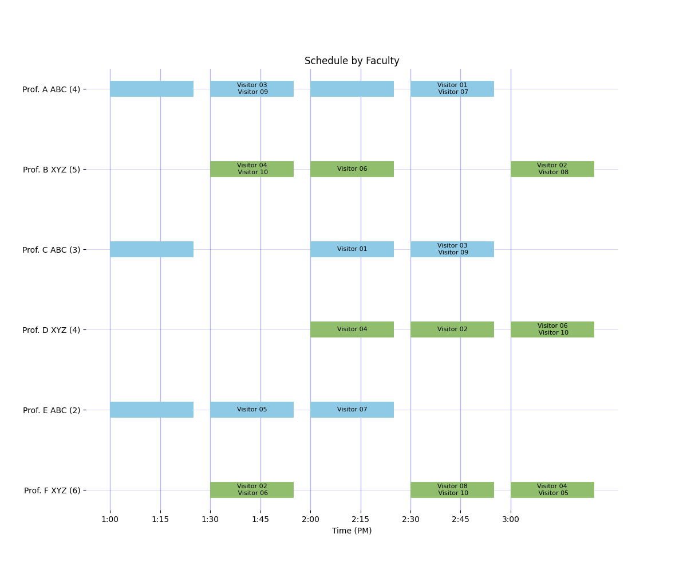

# Building Movement and Staggered Starts

This page documents the new movement interface in the run config (`movement:`),
which generalizes scheduling across one, two, or many buildings.

All examples on this page use the larger formulation visitor dataset:

- `examples/data_formulation_visitors.csv`
- `examples/faculty_formulation.yaml` (or building-variant catalogs derived from it)

GitHub source links for this page:

- [movement docs examples folder](https://github.com/dowlinglab/grad-visit-scheduler/tree/main/examples)
- [one/two/three building script](https://github.com/dowlinglab/grad-visit-scheduler/blob/main/scripts/run_building_configuration_examples.py)
- [A-first/B-first comparison script](https://github.com/dowlinglab/grad-visit-scheduler/blob/main/scripts/run_shifted_start_comparison.py)

## Movement Configuration

Add a `movement` block to your run config:

```yaml
movement:
  policy: none          # or travel_time / nonoverlap_time
  phase_slot:
    BuildingA: 1
    BuildingB: 1
  travel_slots:         # used for policy: travel_time (or "auto")
    BuildingA:
      BuildingA: 0
      BuildingB: 1
    BuildingB:
      BuildingA: 1
      BuildingB: 0
```

- `policy: none`: buildings are treated as close-proximity; no explicit travel-time constraints.
- `policy: travel_time`: enforces pairwise building-to-building lag constraints using `travel_slots`.
- `policy: nonoverlap_time`: automatically computes `travel_slots` from absolute slot timestamps to prevent real-time overlap.
- `phase_slot`: earliest slot each building is allowed to host meetings. This enables staggered starts.
- `travel_slots: auto`: available with `policy: travel_time`; computes lag matrix from timestamps.
- `min_buffer_minutes`: optional extra buffer applied to auto-computed lag transitions.

## Policy Selection Guide

Use this quick guide to pick the right movement policy:

| Scenario | Recommended policy | Why |
| --- | --- | --- |
| One building | `none` | No inter-building movement exists. |
| Multiple buildings with identical/non-overlapping clock grids and no travel modeling needed | `none` | Simplest model, fastest solve. |
| Shifted or nonuniform building clocks where real-time overlap must be prevented | `nonoverlap_time` | Auto-derives safe lag matrix from absolute times. |
| Need explicit/manual travel lags (domain-specific travel assumptions) | `travel_time` + manual `travel_slots` | Full user control over pairwise lag policy. |
| Want travel-time formulation but avoid hand-building lag matrix | `travel_time` + `travel_slots: auto` | Same automatic lag derivation as `nonoverlap_time`. |

Practical recommendation:
- Start with `nonoverlap_time` for shifted-clock schedules.
- Move to manual `travel_time` only when you have a deliberate reason to override derived lags.

## Shifted Clock Safety

If buildings use shifted/nonuniform clock grids (for example `1:00-1:25` in one
building and `1:15-1:40` in another), `policy: none` can allow real-time
visitor overlaps across adjacent slot indices.

The scheduler now emits a warning for this configuration. Recommended fix:

```yaml
movement:
  policy: nonoverlap_time
  phase_slot:
    MCH: 1
    NSH: 2
  min_buffer_minutes: 0
```

Equivalent explicit option:

```yaml
movement:
  policy: travel_time
  phase_slot:
    MCH: 1
    NSH: 2
  travel_slots: auto
  min_buffer_minutes: 0
```

Dedicated repository example:

- [`examples/config_shifted_nonoverlap_auto.yaml`](https://github.com/dowlinglab/grad-visit-scheduler/blob/main/examples/config_shifted_nonoverlap_auto.yaml)

## Failure Modes and Diagnostics

Common movement-configuration pitfalls and how to fix them.

| Symptom (message) | Likely cause | Recommended fix |
| --- | --- | --- |
| `UserWarning: movement.policy='none' ... can allow real-time visitor overlaps ...` | Shifted/nonuniform building clocks with `policy: none`. | Switch to `policy: nonoverlap_time`, or use `policy: travel_time` with `travel_slots: auto`. |
| `ValueError: Unsupported movement policy '...'` | Typo or unsupported `movement.policy`. | Use one of: `none`, `travel_time`, `nonoverlap_time`. |
| `ValueError: movement.policy='nonoverlap_time' only supports travel_slots omitted or set to 'auto'.` | Manual lag matrix passed with `nonoverlap_time`. | Remove `travel_slots` or set `travel_slots: auto`. Use `travel_time` if you need manual lag control. |
| `ValueError: movement.travel_slots must be a dictionary or 'auto'.` | Invalid `travel_slots` type/value. | Provide nested mapping per building pair, or set `travel_slots: auto`. |
| `ValueError: movement.phase_slot[...] is outside valid slot range ...` | Phase slot index out of bounds. | Use phase slots between `1` and number of configured slots. |
| `ValueError: movement.min_buffer_minutes must be a nonnegative integer.` | Negative buffer value. | Set `min_buffer_minutes >= 0`. |
| `ValueError: Invalid slot label '...'` or `End time must be after start time.` | Malformed time slot strings in `buildings:`. | Use strict `H:MM-H:MM` labels with increasing times (e.g., `1:15-1:40`). |

### Programmatic-config diagnostics

If you construct `Scheduler(..., movement=...)` directly (instead of
`scheduler_from_configs(...)`), these additional travel-matrix errors can occur:

- `movement.travel_slots is missing row for 'BuildingX'`
- `movement.travel_slots['BuildingX'] is missing destination 'BuildingY'`
- `movement.travel_slots values must be nonnegative integers`

These indicate an incomplete or invalid pairwise lag matrix. The matrix must
include every source/destination building pair, with nonnegative integer lags.

## Example Results

The following table is generated by:

```bash
python scripts/run_building_configuration_examples.py
```

TODO: Please explain why these results make sense -- because the buildings are close, these three formulations are mathematically equivalent.

| Scenario | Feasible | Objective | Assignments | Requested Assignments | Group Slots |
| --- | --- | ---: | ---: | ---: | ---: |
| One building | True | 110.9 | 30 | 30 | 13 |
| Two buildings (close) | True | 110.9 | 30 | 30 | 13 |
| Three buildings (close) | True | 110.9 | 30 | 30 | 13 |

## Supported Patterns

### 1) One building

Use a single building in `buildings:` with `policy: none`.

- Example config: [`examples/config_one_building.yaml`](https://github.com/dowlinglab/grad-visit-scheduler/blob/main/examples/config_one_building.yaml)
- Example faculty catalog: [`examples/faculty_one_building.yaml`](https://github.com/dowlinglab/grad-visit-scheduler/blob/main/examples/faculty_one_building.yaml)
- Visitor data: [`examples/data_formulation_visitors.csv`](https://github.com/dowlinglab/grad-visit-scheduler/blob/main/examples/data_formulation_visitors.csv)



### 2) Two close buildings (no travel-time constraints)

Use two buildings with `policy: none` and both phase slots set to `1`.

- Example config: [`examples/config_two_buildings_close.yaml`](https://github.com/dowlinglab/grad-visit-scheduler/blob/main/examples/config_two_buildings_close.yaml)
- Faculty catalog: [`examples/faculty_formulation.yaml`](https://github.com/dowlinglab/grad-visit-scheduler/blob/main/examples/faculty_formulation.yaml)
- Visitor data: [`examples/data_formulation_visitors.csv`](https://github.com/dowlinglab/grad-visit-scheduler/blob/main/examples/data_formulation_visitors.csv)



### 3) Three or more close buildings (no travel-time constraints)

Use `policy: none` with one `phase_slot` entry per building.

- Example config: [`examples/config_three_buildings_close.yaml`](https://github.com/dowlinglab/grad-visit-scheduler/blob/main/examples/config_three_buildings_close.yaml)
- Example faculty catalog: [`examples/faculty_three_buildings.yaml`](https://github.com/dowlinglab/grad-visit-scheduler/blob/main/examples/faculty_three_buildings.yaml)
- Visitor data: [`examples/data_formulation_visitors.csv`](https://github.com/dowlinglab/grad-visit-scheduler/blob/main/examples/data_formulation_visitors.csv)



## Staggered Starts (A First vs B First)

Staggered starts are now represented through `phase_slot`.

- Building A first:

```yaml
movement:
  policy: none
  phase_slot:
    BuildingA: 1
    BuildingB: 2
```

- Building B first:

```yaml
movement:
  policy: none
  phase_slot:
    BuildingA: 2
    BuildingB: 1
```

Repository configs:

- [`examples/config_shifted_a_first.yaml`](https://github.com/dowlinglab/grad-visit-scheduler/blob/main/examples/config_shifted_a_first.yaml)
- [`examples/config_shifted_b_first.yaml`](https://github.com/dowlinglab/grad-visit-scheduler/blob/main/examples/config_shifted_b_first.yaml)

Comparison runner:

```bash
python scripts/run_shifted_start_comparison.py
```

This script solves both scenarios and prints a side-by-side table of objective
value and key schedule metrics, then writes both visitor and faculty plots.

The script uses:

- [`examples/faculty_formulation.yaml`](https://github.com/dowlinglab/grad-visit-scheduler/blob/main/examples/faculty_formulation.yaml)
- [`examples/data_formulation_visitors.csv`](https://github.com/dowlinglab/grad-visit-scheduler/blob/main/examples/data_formulation_visitors.csv)
- [`examples/config_shifted_a_first.yaml`](https://github.com/dowlinglab/grad-visit-scheduler/blob/main/examples/config_shifted_a_first.yaml)
- [`examples/config_shifted_b_first.yaml`](https://github.com/dowlinglab/grad-visit-scheduler/blob/main/examples/config_shifted_b_first.yaml)

Results:

| Scenario | Feasible | Objective | Meetings | Requested Meetings | Group Meetings |
| --- | --- | ---: | ---: | ---: | ---: |
| Building A first | True | 101.8 | 26 | 26 | 11 |
| Building B first | True | 94.9 | 24 | 23 | 9 |

Visitor-view plots:





Faculty-view plots:





## Executable Comparison Across 1/2/3 Buildings

Run all close-proximity building-configuration examples (one, two, and three buildings)
on the large formulation dataset:

```bash
python scripts/run_building_configuration_examples.py
```

This prints a side-by-side summary table with objective and assignment metrics.

## Legacy Mode Compatibility

`mode=Mode.BUILDING_A_FIRST`, `mode=Mode.BUILDING_B_FIRST`, and
`mode=Mode.NO_OFFSET` remain available with `FutureWarning`, but `movement` is
the preferred interface for new code.

## Legacy Mode Migration Guide

Equivalent `movement` mappings:

- `Mode.BUILDING_A_FIRST`:

```yaml
movement:
  policy: none
  phase_slot:
    BuildingA: 1
    BuildingB: 2
```

- `Mode.BUILDING_B_FIRST`:

```yaml
movement:
  policy: none
  phase_slot:
    BuildingA: 2
    BuildingB: 1
```

- `Mode.NO_OFFSET`:

```yaml
movement:
  policy: travel_time
  phase_slot:
    BuildingA: 1
    BuildingB: 1
  travel_slots:
    BuildingA:
      BuildingA: 0
      BuildingB: 1
    BuildingB:
      BuildingA: 1
      BuildingB: 0
```

For shifted absolute slot clocks, prefer:

```yaml
movement:
  policy: nonoverlap_time
  phase_slot:
    BuildingA: 1
    BuildingB: 2
```

Break-behavior nuance:

- Legacy `Mode.NO_OFFSET` implicitly enables break constraints by default.
- Movement-only configs do **not** implicitly enable break constraints.
- To match legacy `NO_OFFSET` break behavior, set `enforce_breaks=True` in
  `schedule_visitors(...)` / `schedule_visitors_top_n(...)`.
